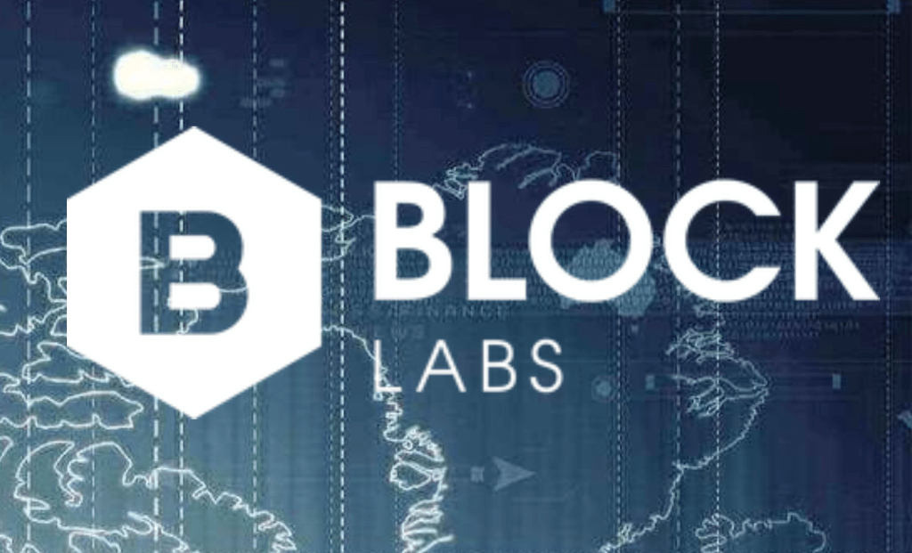
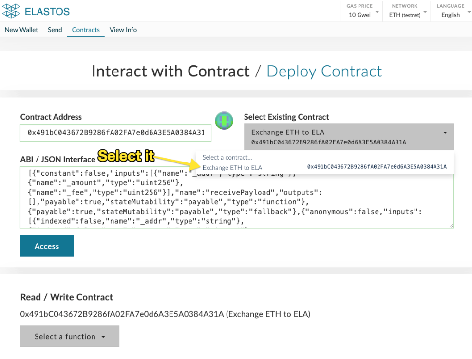

ETH Task Force Sep and Oct 2019 Report

<!--truncate-->

## Key Highlights

### Riwigo will build their PoC on ETH sidechain

https://cyberrepublic.press/cyberrepublicxriwigo/

Riwigo is an Asia-Pacific wellness organization. Riwigo aspires to create a global standard and overall ecosystem for healthcare and wellness data. Their goal is to have built-in privacy and proven authentication through Distributed Ledger Technologies.

Riwigo will be deploying a Proof of Concept dApp on the Elastos-Ethereum (ELA-ETH) sidechain utilizing the Elastos Carrier to build a decentralized governance model to standardize and manage private user health data.

### Block Labs x Elastos

https://blog.cyberrepublic.org/2019/10/16/block-labs-x-elastos-suggestion-164/

Through our marketing effort we got Block Labs, that is a leading blockchain establishment in Sydney, Australia, that currently runs the largest blockchain community in the area, leads the board of Blockchain Australia, and hosts workshops for dApp developers.

Block Labs is looking to establish a strong local Elastos community in Sydney. The team also seeks to increase market presence, introduce existing developer and workshop communities to Elastos, align and onboard Elastos technology for business associates, and provide services to the current Block Labs community.

## Competing dApps of FundMyDapp like ETH sidechain

https://cyberrepublic.press/fundmydapp-round-1/

FundMyDapp, a competition run by Elephant Wallet and Enter Elastos Supernodes, has completed its first round of dApp submissions.

More than half of the submitting dapps are choosing ETH sidechain as the platform to build their dapps. ETH task force team already has a set of tools ready for them to build their MVP, such as elastosjs.com, RPC service, block explorer and web wallet.

## Elastos ETH Sidechain Tooling

### RPC:

ETH task force team setup a mainnet RPC for the developer community, which is the first public service in ETH sidechain ecosystem, it can be used as many kinds of parties, such as wallet, explorer , dapps and all others intend to interact with ETH sidechain. The RPC url is: https://mainrpc.elaeth.io

### Web wallet:

With the mainnet RPC ready, now the web wallet support mainnet, it means now all the features used on testnet will also be available on mainnet. Try to send token and interact with smart contract at https://wallet.elaeth.io .

Another exciting feature we added is ELA cross chain transfer from ETH sidechain to Elastos mainchain, the ratio between ETH and ELA is 1:1. If you want to try it, go to https://wallet.elaeth.io/#contracts then select the pre-existing contract “Exchange ETH to ELA”.

### Block Explorer:

We also did several improvements and bug fixes for block explorer.
Able to show miner address for each block
Migrate block explorer to a new server due to the fast increasing index data from blockchain
Fixed ELA token price chart issue
Fixed several UI display issues
Fixed getminedblocks api return empty issue

Go to https://explorer.elaeth.io/ to play with the explorer for testnet.

As per request from community, they want us to support mainnet, we will do it for the next phase.

### elastosjs.com:

Updated all demos and tutorials since we have new services, we will not go to any details here.

## DApps Porting to Elastos ETH Sidechain

### ENS

Since ENS is a very important infrastructure, we spent a lot of time to investigate the solution that suitable to us, we need some features include claim and upgradable protocol. Claim feature allows current influential .com domain name holders to get .eth domain names. Upgradable protocol will give us more flexibility.

After the research between ENS and Handshake, we found current ENS is good for us to port, it has 3 phases include claim/reserve:

- Phase 1: Reservation for 3-6 character ENS name https://reserve.ens.domains/
- Phase 2: Auction for 3-6 character https://opensea.io/ens
- Phase 3: Open to register all names

Upgradable protocol can be achieved by adding eip 1822 proxiable support.

So next we just need to decide some parameters to deploy and launch:

- When we want to start the phase 1
- How long will be every phase(can be same as ENS)?
- Minimal bid for 3-6 character name

ENS will be finished porting in next phase of ETH task force team operation.

### Aragon

Aragon is an operating system for DAO management, it has different modules includes kernel, permissions management, client and UI, etc. We have been figured out the process to port the entire system, and also tried to deploy 60% of Aragon’s contracts to our sidechain.

Since Riwigo will use Aragon to vote for their data changes, we both agree to migrate the work to Riwigo and ETH task force team will support them.

## Other Highlights:

### Dacsee

Dacsee is seeking to develop a PoC on ETH sidechain, this PoC need to utilize their token on Ethereum. ETH task force team did research and deployed contracts on ETH sidechain to support the cross chain transfer.

### India CR region

After Elasto pushed to India and hosted a meetup in Bangalore, our India CR region team keep pushing Elastos to more developers and communities, this time is in Delhi.

### Crypto Skyscraper dapp

Worked together and help Teamtaoist team published game dapp funding suggestion on CR https://www.cyberrepublic.org/suggestion/5d8ed012cb892600784dd9a9

### Treegame dapp

Published treegame dapp funding suggestion https://www.cyberrepublic.org/suggestion/5d9e0302cb892600784ddaf1

## Minor Updates

We are working with Oracle team to help them to deploy their Oracle service to ETH sidechain. More details will be release in the future.

## Issues Paused Goals

We moved some goals to this paused section since we have determined through feedback from developers that the ETH support and tooling is not mature enough.

Goals that are affected:

- 1 complex demo in a different industry for the rest of the quarter
- 20 viable candidates for future growth of the team
- 6 session course
- 10 new projects from other blockchain projects ported or developing on Elastos

Regarding tutorials, demo and courses, we target to begin again in early 2020 to time the ETH platform release with the Trinity launch (to be determined - target Q1)

Regarding dapps/projects porting, we will try to make the tooling on ETH sidechain mature in next phase.
