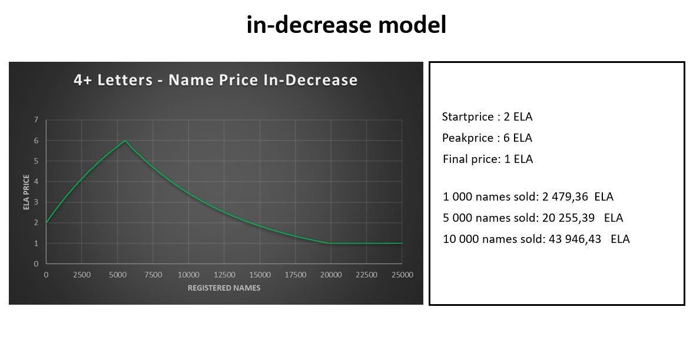

After several months working, ElaNS is launched, now everyone in Elastos ecosystem could have a .ela domain in 3 minutes.

Start your .ela domain journey here:

<https://elans.elaeth.io/>

There are several key differences from Ethereum ENS, the first one is we use .ela domain rather .eth. Second one is the price model, we use a increase-decrease model which we will talk about in next section.

## Price model

We use increase-decrease price model(Thanks for BigP's contribution for this), each purchasing will increase the domain price, then decrease after reach to the highest price(6 ela), then finally stabilize at 1 ela.

## Domain management

There is no difference for managing your domain from Ethereum ENS. You can refer to ENS document <https://docs.ens.domains/>.
