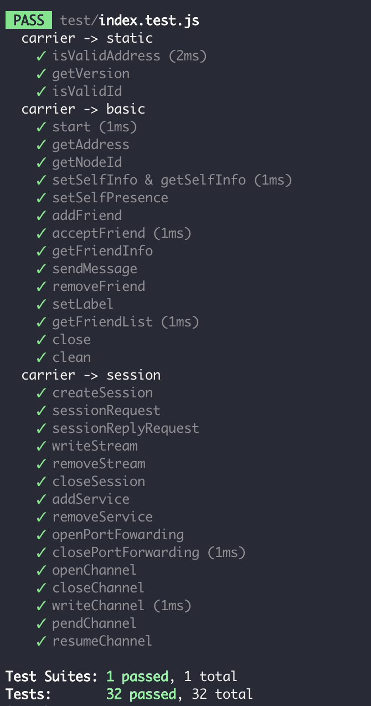

# React Native Elastos Carrier Plugin

Elastos Carrier is a decentralized peer-to-peer platform that takes over all network traffic between virtual machines and conveys information on applications’ behalf.

This repo is the react native bridge between native carrier lib and javascript api. so developer could easy to create a elastos dapp with carrier module by javascript.

The release version for plugin is [here](https://www.npmjs.com/package/elastos-unity-carrier)

## Installation

You can install the react-native-unity-elastos-carrier package using npm or yarn:
```
## with npm
npm install --save react-native-elastos-unity-carrier
# with yarn
yarn add react-native-elastos-unity-carrier
```

## Platform specific Linking 

### Automatic linking

#### iOS

- RN < 0.60
```
react-native link react-native-elastos-unity-carrier
```
- RN > 0.60
```
cd ios
pod install
```

### Manual linking

#### Android
add following lines to project build.gradle 
```
flatDir{
    dirs "$rootDir/../node_modules/react-native-elastos-unity-carrier/android/libs"
}
```
under allprojects repositories block.

### Unit test with Jest
For plugin JS side, integrate with Jest to mock and test. 
```
npm test
```


### ESLint to format code
```
npm run lint
```


## Usage
```
const carrier = new Carrier('app_name', {
    // carrier callback
});
await carrier.start();
```

The complete documentation is available on: [elastosunity.com/docs/carrier](http://elastosunity.com/docs/carrier/#introduction)