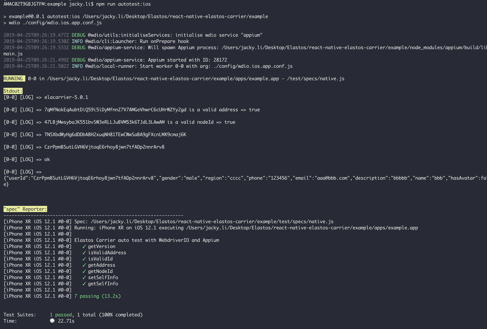

# Example for carrier plugin

## Run unit test for javascript side
```
npm test
```

## Run autotest with appium and webdriver (iOS)
* Change config/wdio.ios.app.conf.js
```
  deviceName: 'iPhone XR', 
  platformName: 'iOS',    
  platformVersion: '12.1',

  // The path to the app
  app: join(process.cwd(), './apps/example.app'),
```
* Build example.app with xcode and replace the ./apps/example.app with build result.
* run **npm run autotest:ios**
